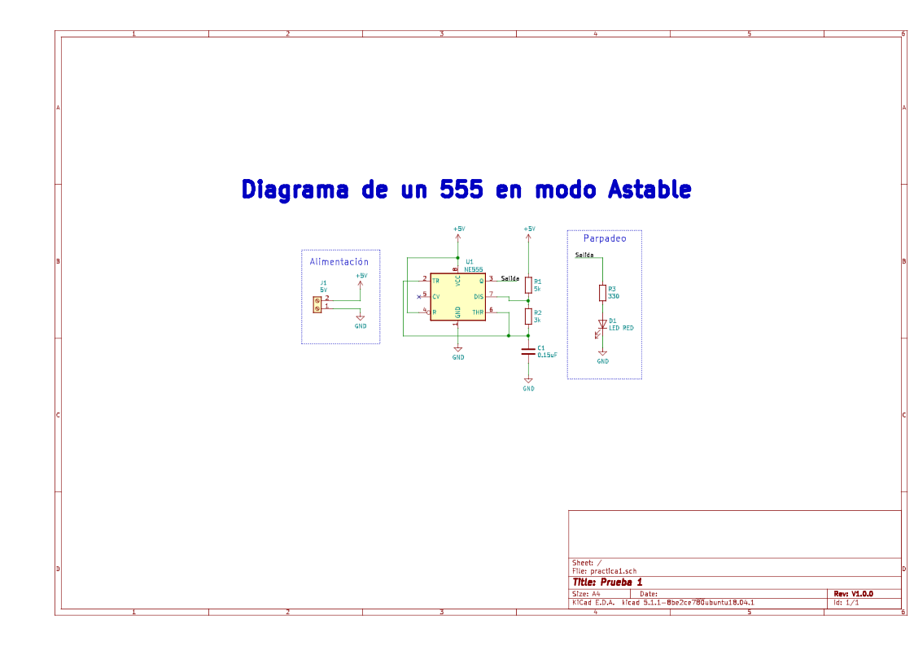
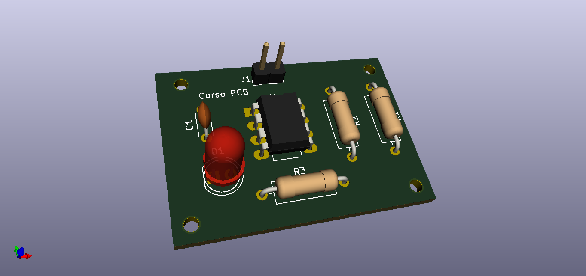

# Curso básico de KiCad

Curso básico de Kicad desde el proceso de instalación hasta culminar con una PCB

## Curso en YouTube

Lista de reproducción en YouTube

- [1. Instalación y prueba de kiCad en windows](https://youtu.be/QeJxQIdk3iI)
- 
- 
- 
- 
- 
- 

## Archivos

### Esquemático

### 3D 

