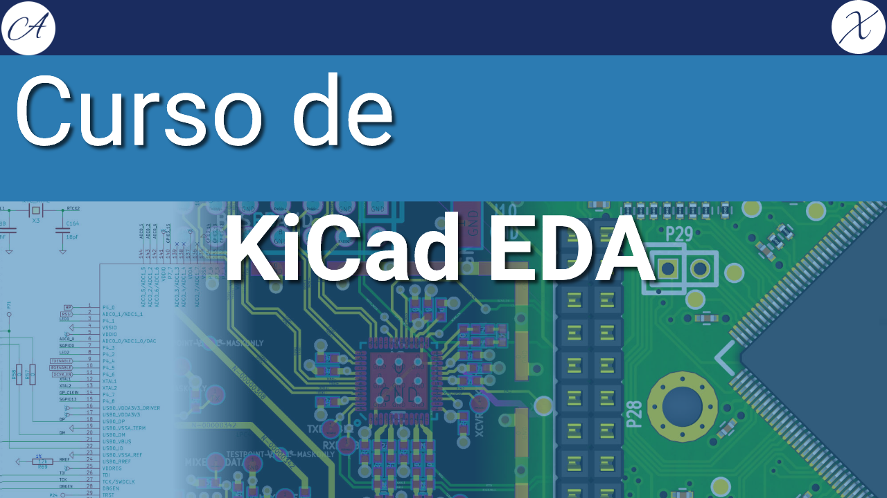

# Curso básico de KiCad

Curso básico de Kicad desde el proceso de instalación hasta culminar con una PCB.
Se desarrolla una PCB utilizando un NE555, construyendo un osculador Astable, desde la face de creación del esquemático hasta su terminanción en una PCB.

## Curso en YouTube

[Lista de reproducción en YouTube](https://www.youtube.com/playlist?list=PLE7RuMYW0W5Di71-aiWNUxpenKBAk5KDZ)

- [1. Instalación y prueba de kiCad en windows](https://youtu.be/QeJxQIdk3iI)
- [2. Creando esquemático en kicad](https://youtu.be/BZhZgBaz_h0)
- [3. Agregando más detalles a esquemático kicad](https://youtu.be/TywXVqaktTU)
- [4. Cómo exportar diagrama esquemático kicad](https://youtu.be/NpxuoHJrbj8)
- [5. Introducción a qué son los footprint](https://youtu.be/b3a9KcL0cfA)
- [6. Asignando footprint a componentes kicad](https://youtu.be/LjzxLj3viCg)
- [7. Aprendiendo más sobre footprints y package de componentes electrónicos kicad](https://youtu.be/rXnbt5xWTdQ)
- [8. Creando PCB desde cero del esquemático kicad](https://youtu.be/4rYowXPnbXY)
- [9. Personalizando PCB kicad](https://youtu.be/jkqt4m4lfhA)
- [10. Exportando pcb para impresión kicad](https://youtu.be/TpHnDHIXOLU)

## Archivos

### Esquemático

### 3D

